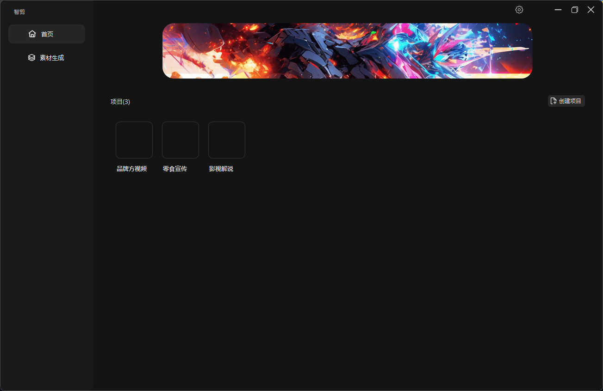
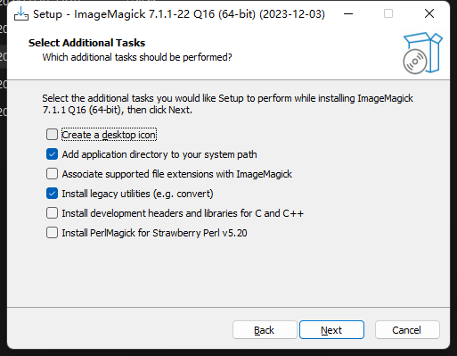

# 🎥Smart Cut

## 💡概述

## 🎯功能特点

1. **🚀批量生成**：只需输入素材和文案，智剪即可自动批量生成视频，大大提升了视频制作的效率。

2. 🛠素材处理：智剪提供素材处理功能，可以将批量将多个完整的视频素材智能分割成多个镜头素材，并保存为独立的视频文件，用于生成大量的视频素材。

3. **🔊配音和音乐支持**：智剪支持多个配音平台，例如微软、火山（抖音）等，并支持添加背景音乐， 让您的视频能够更丰富、更能唤起观众的感官体验。

4. **📚自动生成字幕**：智剪自带字幕识别功能，能够无缝地为您的视频生成字幕。

5. **💪强大的性能**：视频生成速度按照您的电脑配置，但在大部分配置下，智剪都能在短时间内制作出200到1000个高质量的视频。

6. **🌐广泛的应用领域**：利用智剪，您能对各种类型的视频进行生成，例如带货类、门店宣传类、品牌产品推广类、广告线索获取类以及影视解说类视频等。

7. **🎨自定义设置**：智剪允许用户自定义镜头顺序或选择随机混剪模式，帮助您打造出独特的视频风格。

8. **🧩兼容多个AI平台**：智剪支持与chatGPT、文心一言、讯飞星火等多个AI平台对接，能够充分利用各平台的长处，提高您的创作效率。

借助智剪，大规模的视频制作变得更加轻松、高效。使用自有的素材库和文案，您可快速创作出大量优质视频，满足各种场景的需求。

## 介绍

智剪软件依赖[ImageMagick](https://www.imagemagick.org/script/index.php)

需要先安装ImageMagick图像处理库。点击[ImageMagick下载](https://www.imagemagick.org/script/download.php#windows)，请选择合适的系统版本安装

发布包中也提供了ImageMagick安装包，双击安装即可。

在安装ImageMagick时请注意勾选 `install legacy utilities (e.g.convert)` 选项

smartspit.exe 本身是免安装版本，你可以将包含smartspit.exe的整个文件夹放入任意合适的位置（注意放入的路径不能包含中文），为了方便使用，你也可以为他创建一个桌面快捷方式。

## 使用说明
#### 1. 设置
打开软件后你应该点击右上角设置图标，进入设置页面，设置你的选项
1. 保存位置，选择合适的保存位置，所有生成的视频、音乐文件将保存在此文件夹下
2. 背景音量，如果你需要背景音乐，你应该调整背景音乐大小，通常需要降低到0.5以下，具体依赖你的背景音乐文件本身，当然你可以不调整保存成1.0
3. 字体，smartsplit.exe 支持所有的字体文件，如果你需要额外的字体，请下载字体文件保存到，下载包中的`font` 文件夹下，重启软件后会自动识别，注意，**字体的文件名称不能包含中文字符**
4. 配音，软件支持Azure和抖音火山的配音服务，注册账号和创建应用，你可以获取对应的sk、access token等信息。
5. 字幕，软件支持自动识别字幕文件，当你选择本地字幕时，你需要选择一个文件夹，用来保存识别字幕的模型文件，他首次会自动下载所需的模型。

#### 2. 创建项目
你可以创建一个项目，并重名名它，当你创建一个项目时，他会在你的保存文件夹下创建一个项目文件夹。
#### 3. 视频生成
1. 在确认所有的设置设置完成之后（通常你只需要在首次使用时设置），你可以开始生成视频了。
2. 在生成视频之前，你需要导入自己的视频素材，它可以支持按镜头导入或者，全部导入到一个镜头。当按镜头导入时，他会按照镜头顺序选择素材（通常他被用在音画同步的场景下）
更简单的时你可以把所有素材导入到一个镜头中，并选择全部模式，他会进行任意混剪。
3. 你可以添加背景音乐，生成视频时会自动为你加上背景音乐
4. 添加你的文案(可以一次选多个)，点击开始生成，软件会开始自动生成视频。

